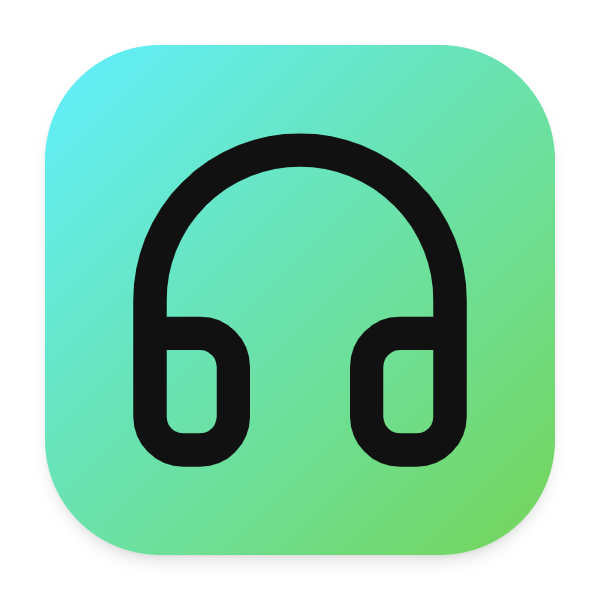

<div align="center">

[](#readme)
# BradTunes

[](#installation "Installation")
[](https://buymeacoffee.com/its.brad "Buy me a coffee")
[](https://discord.gg/5CC6AfrK "Discord")
[](https://portfolio-brad.vercel.app)
[](https://co.linkedin.com/in/brad-salom%C3%B3n-moyetones-navas-726b9a1a8)
[](https://www.instagram.com/bradnavas_/)
[](LICENSE "License")
[](https://github.com/BradMoyetones/BradTunes/commits "Commit History")
[](https://github.com/BradMoyetones/BradTunes/pulse/monthly "Last activity")

</div>


# Electron Media Downloader

This is an open-source app built with **Electron** and **yt-dlp** for downloading and converting **copyright-free** or **Creative Commons licensed** media content.

# INSTALLATION

<!-- MANPAGE: BEGIN EXCLUDED SECTION -->
[](https://github.com/BradMoyetones/BradTunes/releases/latest/download/bradtunes-1.0.7-setup.exe)
[](https://github.com/BradMoyetones/BradTunes/releases/latest/download/bradtunes-1.0.7.dmg)
[](https://github.com/BradMoyetones/BradTunes/releases)

# Project Setup

## ⚡ Requirements
- yt-dlp ([Official repository](https://github.com/yt-dlp/yt-dlp))
- ffmpeg ([Official repository](https://ffmpeg.org/))

## 🛠️ Installation

- Download the **yt-dlp** and **ffmpeg** binaries.
- Place them in the `/public` folder.
- Run the app with:

## 🏃‍♂️ Run Locally

Clone the project

```bash
$ git clone https://github.com/BradMoyetones/BradTunes.git
```

Go to the project directory

```bash
$ cd BradTunes
```

Install dependencies

```bash
$ npm install
```

Start the server

```bash
$ npm run dev
```


## 👷‍♂️ Build

```bash
# For windows
$ npm run build:win

# For macOS
$ npm run build:mac
```

## ⚖ License

[MIT](https://choosealicense.com/licenses/mit/)
